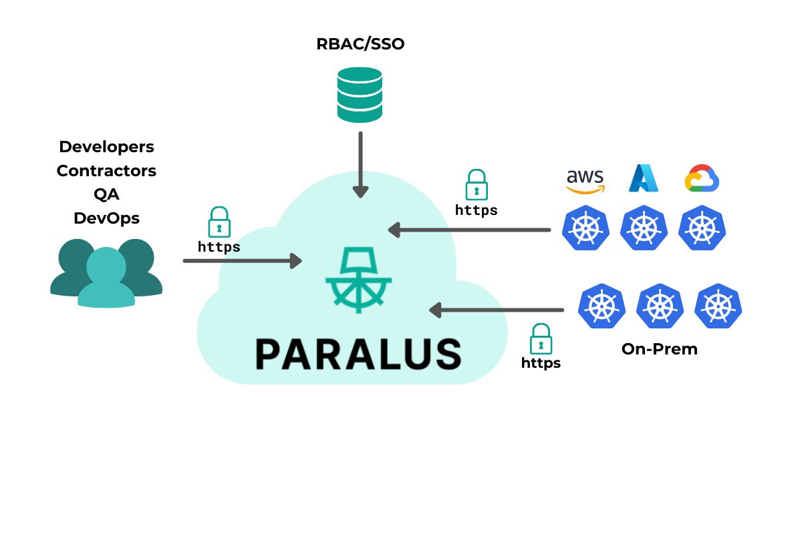

Paralus — the Zero-Trust Kubernetes access management tool — is now open source and free for everyone!
We are SO excited to bring it to the open source world.

<!--truncate-->

## Meet Paralus: The Access Manager for Kubernetes

Numerous tools exist for managing Kubernetes infrastructure, from the default Kubernetes Role Based Access Control method to DIY management solutions. However, these tools suffer from a lack of scalability and are difficult to use as the number of individually-configured clusters increases. At Rafay (we're the maintainers of the project, hi!), we solved this challenge by building a [Zero-Trust Access Service](https://rafay.co/platform/zero-trust-access-service/), which is part of the larger enterprise platform. This same service forms the basis of open-source Paralus.

Paralus helps everyone with multi-cluster environments on the scale of one to thousands of clusters. It can be easily integrated with pre-existing RBAC/SSO providers, or Identity Providers that support OIDC. Through just-in-time service account creation and fine-grained user credential management, Paralus provides teams with an adaptable system for guaranteeing secure access to resources when necessary, along with the ability to rapidly identify and respond to threats.

In addition to the robust features that Paralus has inherited from the Rafay Zero-Trust Access Service, Paralus offers several added improvements, namely IdP support, custom roles, and dynamically changing permissions.

## Main features of Paralus

The following are several key features of the Paralus project:

- **Centralized access**: management to all users across multiple Kubernetes clusters is unified and centralized. Your users can be located anywhere, your clusters can be either hosted in the cloud or on-prem. With Paralus, you can handle access-management for all clusters through a single tool.

- **Secured kubectl access**: Paralus can be integrated with your existing enterprise RBAC policies and even with your SSO provider. This allows teams to leverage existing security policies and SSO procedures and guarantees that only authorized users can access your Kubernetes infrastructure.

- **Immutable audit trails**: Each and every kubectl command executed by users across your organization is recorded. All actions including creation of groups, users, projects and roles are also recorded. These audit trails are immutable and allow for confirmation of compliance with industry standards and policies.

- **Support for OIDC**: [OpenID Connect](https://openid.net/connect/) is an open source authentication protocol built on top of OAuth2. This open source protocol provides support for authentication via multiple identity access providers. You can now leverage the power and flexibility of OIDC baked right into Paralus. Use it with GitHub, Google, Microsoft or Okta — it works with all leading Identity Access Providers (IdPs).

- **Custom roles**: Rafay’s original implementation of the Zero Trust access service had a selection of immutable predefined roles. With Paralus, we introduced finer control through the creation of custom roles with specific permissions — all compatible with an Identity Access provider.

- **Dynamic permissions**: Paralus allows you to dynamically revoke permissions, making it easier to govern access. You can create a role and add/remove policies and permissions to it without having to delete a role and recreate it.

- **Multiple workflows**: Depending on your preference, Paralus can be used in three different forms: a webapp GUI, a CLI tool called [pctl](/docs/usage/cli), or as an API.

We’ve also open sourced our [roadmap](http://github.com/paralus/paralus/ROADMAP.md) so you can have a look at what else we’re planning for Paralus. Suggestions and improvements, in the form of [GitHub Issues](http://github.com/paralus/paralus/issues), are more than welcome!

## Why we built Paralus

For organizations managing user access to numerous Kubernetes clusters at once, maintaining security while ensuring that users can access only the resources they need is a complex balancing act. Oftentimes, teams manage access to each cluster separately, sometimes using jump hosts or VPNs, and with makeshift tooling to audit the actions performed by each user. Unfortunately, this approach is error-prone, risky in terms of breaches, and becomes even harder to maintain as the number of clusters and people grows in the organization.

For teams operating on Kubernetes infrastructure, Zero-Trust principles promise a resolution for access security concerns: providing the ability to grant individuals access to necessary resources, while preventing them from exceeding the scope of their assigned permissions at an atomic- or transaction-level.

This, of course, begs the question, how can organizations apply Zero-Trust principles for securing and managing their Kubernetes environments, yet do it in a human-friendly way? Of course, the answer is the title of this post!

We can't wait for you to try Paralus: the first ever open source Zero Trust access service for Kubernetes.

## Try it out!

[Installing](https://www.paralus.io/docs/installation) Paralus takes around the same time it takes to make a (good) cup of coffee.

We are looking forward to hearing about your experiences with Paralus. Head over to our [GitHub repo](http://github.com/paralus/paralus) and [docs](/docs) to help you get started. For any questions, support, or interest in contributing, join the [Paralus Slack community](https://join.slack.com/t/paralus/shared_invite/zt-1a9x6y729-ySmAq~I3tjclEG7nDoXB0A). We’re on [Twitter](https://twitter.com/paralus_) too!
